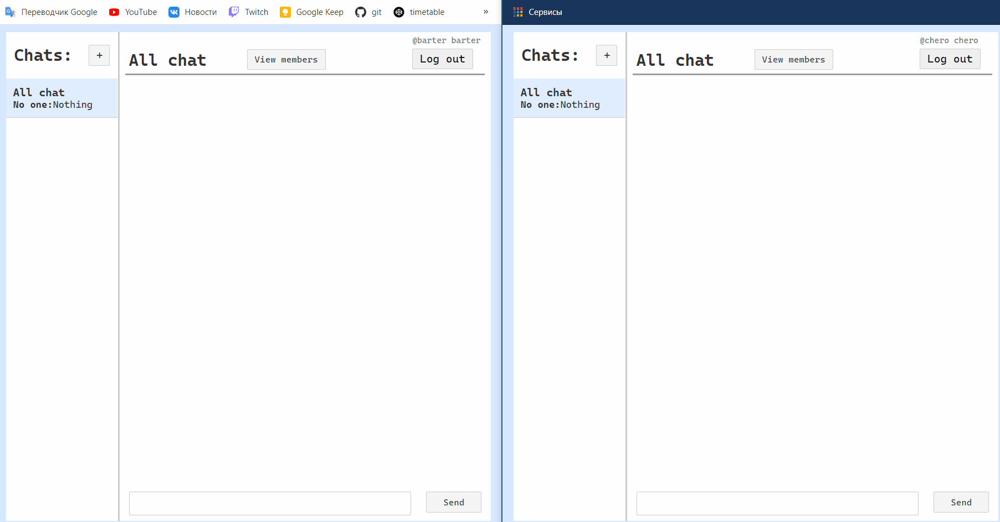

# chat-app
Chat app, hosted on heroku. [Try](http://barter-chat-app-with-cringe.herokuapp.com/) this out!  
**First run can be realy slow, like 10 sec or smth, due to serverless functions of Heroku free tier. Be patient!**
Developed with **flask** as server, **svelte** as front-end (javascript library) and **psql** database (pure, without ORM).  
**Socket-io** used on both client and server side to emitting messages. 
You can create chat rooms and chit-chat about anything you want!
## Showcase

In order to install it, run `npm run heroku-prebuild` in root directory, then `pip install -r requirements.txt` (version 3.9 is my version, not sure about required), then you need to specify your _SALT_ variable (`set SALT=saltname` on windows) and finally `python application.py`
